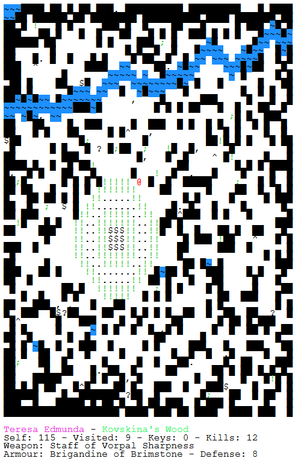
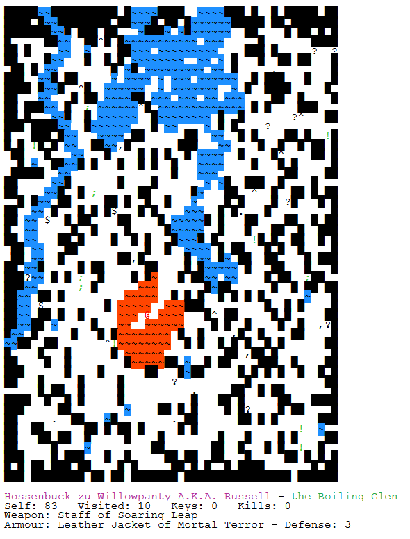
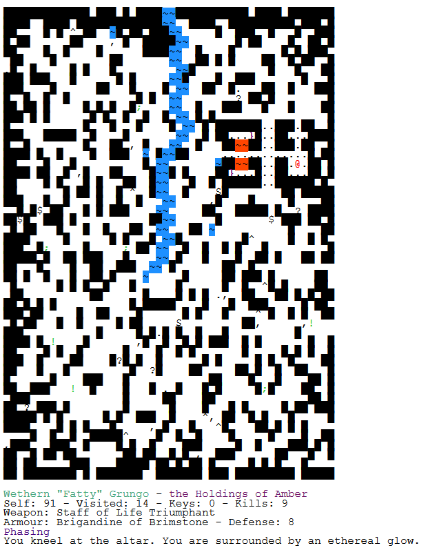
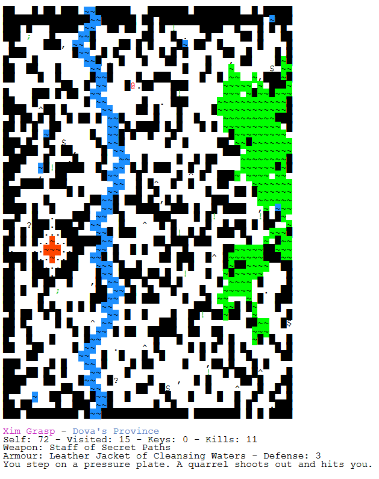

<div align="center">

# Wanderer


</div>

_There are so many worlds to explore, but only so much of you left..._

A small roguelike game written in JavaScript.

### How to play

Playable in browser [here](https://red-kangaroo.github.io/wanderer/ "Wanderer").

Have fun!

### Controls

```
Move around with:
                 W
 arrow keys    A   D
                 S

     8           K
   4   6       H   L
     2           J

Use Space, '.' or '5' to wait a turn.

Use 'X' or '0' to invoke the powers of your magic staff, if you have one.

Hold 'Ctrl' to highlight your avatar.

Use 'F11' for fullscreen mode.

Use 'Ctrl +' and 'Ctrl -' to adjust the size to your liking.

Press '?' in-game for more help.
```

### Screenshots
<div align="center">







</div>
