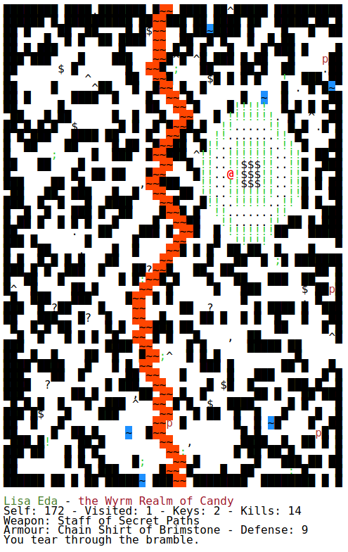
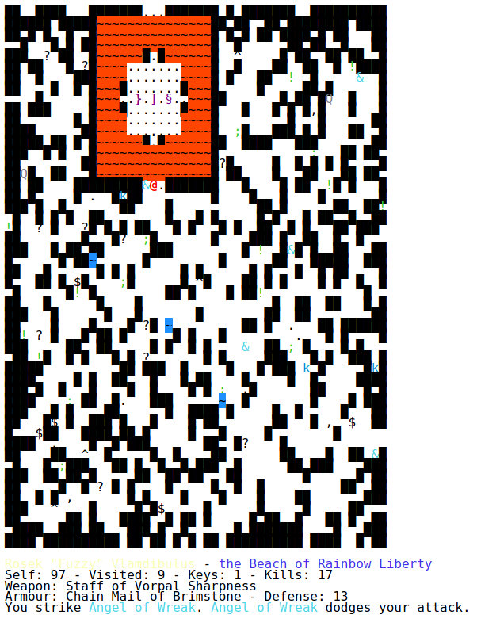

<div align="center">

# Wanderer


</div>

A small roguelike game written in JavaScript.

### How to play

Download the `src/Wanderer.html` file and open it in your web browser of choice.
You might wish to press `F11` to enter a full-screen mode if the game doesn't
otherwise fit on your screen.

Have fun!

### Controls

```
Move around with:
                 W
 arrow keys    A   D
                 S

     8           K
   4   6       H   L
     2           J

Use Space, '.' or '5' to wait a turn.

Use 'X' or '0' to invoke the powers of your magic staff, if you have one.

Press '?' in game for more help.
```

### Screenshots
<div align="center">




</div>
